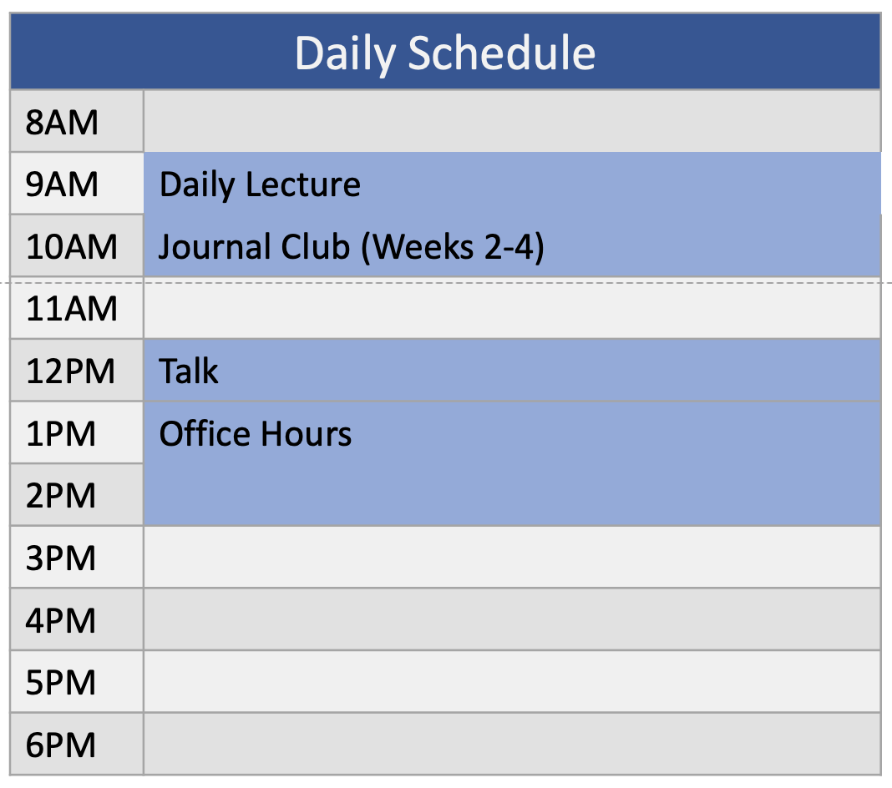

# Coriell Bioinformatics Research Experience 2021

The Bioinformatics Research Experience is a four-week research training program for undergraduate students interested in learning scientific biological data analysis. The previous year's material can be seen here: [2020](https://coriell-bre.github.io/2020_Bioinformatics_Research_Experience/)

---

## Schedule

#### Talks and Lecture Topics

- [Daily Lecture Topics](https://docs.google.com/spreadsheets/d/1NnAIafN6x1MkCAhuXARa-80PsDZWWSrKE3W4T8rdy_U/edit?usp=sharing)
- [Speaker List](https://docs.google.com/spreadsheets/d/1zB7tjQF1Xtp6KgiZ6rR0qtcah-rLtHwZUWlpgb7APEc/edit?usp=sharing)

---

## Getting Started

### Programs to Install

1. Zoom <https://zoom.us/download>
2. Slack <https://slack.com/>. If you're familiar with Slack, our slack name is coriellbioinf-se37156. Otherwise you can follow the attached directions in slack_intructions.pdf.
3. Download and install TeamViewer <https://www.teamviewer.com/en-us/>. This will allow the research experience team to screen share with your computer to assist with technical problems.
4. R. If you don't already have it installed, go to R Cloud <https://cloud.r-project.org/> to download and install R.
5. RStudio. Go to RStudio's website <https://rstudio.com/products/rstudio/download/> and download the FREE version.

---

## BRE Material

### Journal Club

During the Bioinformatics Research Experience you will give two Journal Clubs, one on one of the papers listed below and the other on a paper of your choosing. Your choice of second paper is due by Friday, 7/16.

- Journal Club Sign Up GoogleSheet <https://docs.google.com/spreadsheets/d/1jFC24C2OL5drmgdDU9ApuyTB8uDavt9VfCs84Gnn6mg/edit?usp=sharing>
- Examples
  - Old Coriell journal club [slides](journal_club/example_slides.pdf)
  - YouTube Video <https://www.youtube.com/watch?v=xXKL9uLFHy4>
- Papers
  - [Cani 2018](journal_club/provided_papers/cani2018_microbiome_review.pdf) Microbiome
  - [Greenberg 2019](journal_club/provided_papers/greenberg2019_methylation_review.pdf) Methylation
  - [Kazazian 2017](journal_club/provided_papers/kazazian2017_mobile_DNA_in_health_and_disease.pdf) Repetitive/Transposable Elements
  - [Klemm 2019](journal_club/provided_papers/klemm2019_chromatin_accessibility_review.pdf) Chromation Accessibility
  - [Stark 2019](journal_club/provided_papers/stark2019_RNAseq_review.pdf) RNA-seq
  - [Tang 2019](journal_club/provided_papers/tang2019_single_cell_review.pdf) Single Cell Sequencing

---

### Daily Lecture Material

#### **July 06:** Welcome and Introduction to Rmarkdown and RStudio

- Introduction to Coriell and Coriell's Bioinformatics Research Experience
- Introduction to Rmarkdown and RStudio
- [slides](R/2021-07-06_introduction_BRE_rmarkdown/2021-07-06_introduction_BRE_rmarkdown.pdf)
- demo [Rmd](R/2021-07-06_introduction_BRE_rmarkdown/2021-07-06_rmarkdown_DEMO.Rmd) and its knitted [html](R/2021-07-06_introduction_BRE_rmarkdown/2021-07-06_rmarkdown_DEMO.html)

 

Today's Assignment: **Rmarkdown Practice** [Rmarkdown](R/2021-07-06_introduction_BRE_rmarkdown/2021-07-06_rmarkdown_assignment.Rmd) and the ANSWER KEY in [Rmarkdown](R/2021-07-06_introduction_BRE_rmarkdown/2021-07-06_rmarkdown_assignment_ANSWERS.Rmd) and [html](R/2021-07-06_introduction_BRE_rmarkdown/2021-07-06_rmarkdown_assignment_ANSWERS.html)

---

#### **July 07:** Introduction to Data Wrangling with `dplyr`

- Examing and subsetting data with base `R`
- Data wrangling with `dplyr`
- [slides](R/2021-07-07_dplyr/2021-07-07_intro_data_wrangling.pdf)
- demo [Rmd](R/2021-07-07_dplyr/2021-07-07_dplyr_demo.Rmd) and updated demo [Rmd with in class additions](R/2021-07-07_dplyr/2021-07-07_dplyr_demo_INCLASS.Rmd)

 

Today's Assignment: **Data Wrangling** [Rmarkdown](R/2021-07-07_dplyr/2021-07-07_dplyr_assignment.Rmd), ANSWER KEY in [Rmarkdown](R/2021-07-07_dplyr/2021-07-07_dplyr_assignment_ANSWERS.Rmd)

---

#### **July 08:** Introduction to Data Visualization with `ggplot2`

- Data visualization with `ggplot2`
- [slides](R/2021-07-08_ggplot/2021-07-08_plotting_ggplot2.pdf)
- demo [Rmd](R/2021-07-08_ggplot/2021-07-08_ggplot2_demo.Rmd) and demo [Rmd with in class additions](R/2021-07-08_ggplot/2021-07-08_ggplot2_demo_INCLASS.Rmd)
- Resources
  - R Graph Gallery <https://www.r-graph-gallery.com/>
  - [R Color Chart](R/2021-07-08_ggplot/ColorChart.pdf)

 

Today's Assignment: **Data Visualization** [Rmarkdown](R/2021-07-08_ggplot/2021-07-08_ggplot2_assignment.Rmd), ANSWER KEY in [Rmarkdown](R/2021-07-08_ggplot/2021-07-08_ggplot2_assignment_ANSWER_KEY.Rmd) 

---
  
#### **July 09:** Reading Data with `readr` and Tidying Data with `tidyr`

- How to read data into `R` using `readr`
- More data wrangling, tidying data with `tidyr`
- [slides](R/2021-07-09_readr_and_tidyr/2021-07-09_readr_tidyr.pdf)
- demo [Rmd](R/2021-07-09_readr_and_tidyr/2021-07-09_readr_tidyr_demo.Rmd) and demo [Rmd with in class additions](R/2021-07-09_readr_and_tidyr/2021-07-09_readr_tidyr_demo_INCLASS.Rmd)
  - demo [data](R/2021-07-09_readr_and_tidyr/measles_vaccination_rates.tsv)

 

Today's Assignment: **Reading in and Tidying Data** [Rmarkdown](R/2021-07-09_readr_and_tidyr/2021-07-09_readr_tidyr_assignment.Rmd) and the [data](R/2021-07-09_readr_and_tidyr/data.zip), ANSWER KEY in [Rmarkdown](R/2021-07-09_readr_and_tidyr/2021-07-09_readr_tidyr_assignment_ANSWERKEY.Rmd) 

---

#### **July 13:** Statistics Review and Tidying R Statistical Tests with `broom`

- Basic Statistical Tests
  - t-test
  - chi-square
  - ANOVA
- Transforming R test results into tidy tables with `broom`
- [slides](R/2021-07-13_statistics_review_broom/2021-07-13_statistics_review.pdf)
- demo [Rmd](R/2021-07-13_statistics_review_broom/2021-07-13_statistics_demo.Rmd) and demo [Rmd with in class additions](R/2021-07-13_statistics_review_broom/2021-07-13_statistics_demo_INCLASS.Rmd)

 

Today's Assignment: **Statistics and broom** [Rmarkdown](R/2021-07-13_statistics_review_broom/2021-07-13_statistics_assignment.Rmd) and the [data](R/2021-07-13_statistics_review_broom/data.zip), ANSWER KEY in [Rmarkdown](R/2021-07-13_statistics_review_broom/2021-07-13_statistics_assignment_ANSWER_KEY.Rmd) 

---

#### **July 14:** Clustering Data

- Clustering
  - kmeans clustering
  - hierarchical clustering with heatmaps
  - Principal Component Analysis (PCA)
- [slides](R/2021-07-14_clustering/2021-07-14_clustering.pdf)
- demo [Rmd](R/2021-07-14_clustering/2021-07-14_clustering_demo.Rmd)

 

Today's Assignment: **Clustering** [Rmarkdown](R/2021-07-14_clustering/2021-07-14_clustering_assignment.Rmd) and the [data](R/2021-07-14_clustering/data.zip), ANSWER KEY in [Rmarkdown](R/2021-07-14_clustering/2021-07-14_clustering_assignment_ANSWERKEY.Rmd) 

---

#### **July 15:** Statistics 2: Linear Models

- linear models
  - calculation and interpretation
  - multiple variables, both additive and interactive
  - selecting the best model
- [slides](R/2021-07-15_statiscs2_lm/2021-07-15_statistics2_lm.pdf)
- demo [Rmd](R/2021-07-15_statiscs2_lm/2021-07-15_statistics2_lm_demo.Rmd)
  - and demo [Rmd with in class additions](R/2021-07-15_statiscs2_lm/2021-07-15_statistics2_lm_demo_INCLASS.Rmd)
  - demo [data](R/2021-07-15_statiscs2_lm/wine.tsv)

 

Today's Assignment: **Linear Models** [Rmarkdown](R/2021-07-15_statiscs2_lm/2021-07-15_lm_assignment.Rmd) and the [data](R/2021-07-15_statiscs2_lm/data.zip), ANSWER KEY in [Rmarkdown](R/2021-07-15_statiscs2_lm/2021-07-15_lm_assignment_ANSWERS.Rmd)

---

#### **July 16:** Exploratory Data Analysis

- [slides](R/2021-07-16_exploratory_data_analysis/2021-07-16_exploratory_data_analysis.pdf)
- in class live exploratory data analysis example in [Rmd](R/2021-07-16_exploratory_data_analysis/eda_inclass_demo.Rmd) and knitted report in [html](R/2021-07-16_exploratory_data_analysis/eda_inclass_demo.html)

 

Today's Assignment: **Exploratory Data Analysis** [assignment](R/2021-07-16_exploratory_data_analysis/exploratory_data_analysis_assignment.pdf) and the [template](R/2021-07-16_exploratory_data_analysis/exploratory_data_analysis_template.Rmd)

  - example [Rmd](R/2021-07-16_exploratory_data_analysis/example_exploratory_data_analysis.Rmd) and example [data](R/2021-07-16_exploratory_data_analysis/colon.csv)
  - Tidy Tuesday <https://github.com/rfordatascience/tidytuesday>

---

#### **July 20:** Introduction to RNA-seq

- Introduction to RNA-seq
  - Lab process and considerations for RNA-seq
  - Overview of processing RNA-seq data
  - General analysis description
  - single cell RNA-seq
  - Reading and wrangling RNA-seq data in R
- [slides](RNA-seq/2021-07-20_intro_rnaseq/2021-07-20_intro_to_rnaseq.pdf)
- demo [Rmd](RNA-seq/2021-07-20_intro_rnaseq/2021-07-20_intro_rna-seq_reading_clustering_demo.Rmd) and with in class [changes](RNA-seq/2021-07-20_intro_rnaseq/2021-07-20_intro_rna-seq_reading_clustering_demo_IN_CLASS.Rmd)
  - demo [data](RNA-seq/2021-07-20_intro_rnaseq/chr21_count_files.zip)

 

Today's Assignment: **Read in RNA-seq Data** [Rmd](RNA-seq/2021-07-20_intro_rnaseq/2021-07-20_assignment_read_cluster_rna-seq.Rmd) and the [data](RNA-seq/2021-07-20_intro_rnaseq/full_count_files.zip), , ANSWER KEY in [Rmarkdown](RNA-seq/2021-07-20_intro_rnaseq/2021-07-20_assignment_read_cluster_rna-seq_ANSWERS.Rmd)

---

#### **July 21:** Clustering RNA-seq and Differential Expression Testing

- normalizing RNA-seq counts
  - Nice overview of RNA-seq normalization and the different normalized counts <https://hbctraining.github.io/DGE_workshop/lessons/02_DGE_count_normalization.html> 
- clustering
- differential expression testing
- [slides](RNA-seq/2021-07-21_clust_diff_exp/2021-07-21_clust_diff_exp.pdf)
- demo [Rmd](RNA-seq/2021-07-21_clust_diff_exp/2021-07-21_clust_diff_exp_demo.Rmd) and with in class addtions [Rmd](RNA-seq/2021-07-21_clust_diff_exp/2021-07-21_clust_diff_exp_demo_IN_CLASS.Rmd)
  - Same demo [data](RNA-seq/2021-07-20_intro_rnaseq/chr21_count_files.zip)

 

Today's Assignment: **Read in RNA-seq Data** [Rmd](RNA-seq/2021-07-21_clust_diff_exp/2021-07-21_assignment_clust_diff_exp.Rmd) and the same [data](RNA-seq/2021-07-20_intro_rnaseq/full_count_files.zip)

---

#### **July 22:** Wrangling and Visualizing RNA-seq Results

- wrangling differential expression results
- MA plots
- volcano plots
- UpSet plots
- [slides](RNA-seq/2021-07-22_diff_exp_results/2021-07-22_diff_exp_results.pdf )
- demo [Rmd](RNA-seq/2021-07-22_diff_exp_results/2021-07-22_diff_exp_results_demo.Rmd) and with in class addtions [Rmd](RNA-seq/2021-07-22_diff_exp_results/2021-07-22_diff_exp_results_demo_IN_CLASS.Rmd)
  - This uses the differential expression table created in yesterday's demo, but it's [here](RNA-seq/2021-07-21_clust_diff_exp/diff_exp.tsv) as well 

 

Today's Assignment: **Read in RNA-seq Data** [Rmd](RNA-seq/2021-07-22_diff_exp_results/2021-07-22_assignment_rna-seq_results.Rmd) and you'll use for data the differential expression table you created with yesterday's assignment

---

#### **July 23:** Review Day

- [demo](RNA-seq/2021-07-23_review_day/2021-07-23_review_day.Rmd), and with in class additions [Rmd](RNA-seq/2021-07-23_review_day/2021-07-23_review_day_IN_CLASS.Rmd)
- demo [data](R/2021-07-16_exploratory_data_analysis/colon.csv)

---

#### **July 27:** Gene Set Enrichment Analysis

- [slides](RNA-seq/2021-07-27_gene_set_enrichment_demo/2021-07-27_gene_set_enrichment.pdf)
- demo [Rmd](RNA-seq/2021-07-27_gene_set_enrichment_demo/2021-07-27_gene_set_enrichment_demo.Rmd) and with in class additions [Rmd](RNA-seq/2021-07-27_gene_set_enrichment_demo/2021-07-27_gene_set_enrichment_demo_IN_CLASS.Rmd)

---

#### **Differential Expression Assignment**

- [assignment](RNA-seq/diff_exp_assignment/differential_expression_assignment.pdf)
- Go to <https://docs.google.com/spreadsheets/d/1dal19nICrX4PoVzh_rjLUfnR1PmBom_JwmGS8A3uPQc/edit?usp=sharing> to sign up for a dataset and for a time to practice your RNA-seq presentation